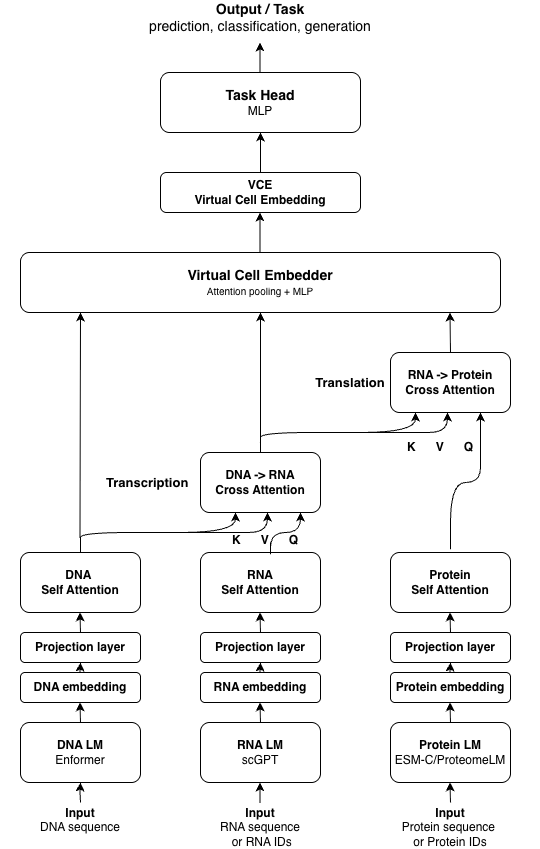

# Central Dogma Transformer (CDT)

**Towards Mechanism-Oriented AI for Cellular Understanding**

CDT is a biology-aligned neural architecture that integrates DNA, RNA, and protein information following the central dogma of molecular biology. Unlike task-oriented approaches that optimize prediction without interpretable representations, CDT's architecture reflects biological information flow, enabling both accurate prediction and mechanistic interpretation.

## Key Features

- **Multi-modal integration**: Combines DNA (Enformer), RNA (scGPT), and Protein (ProteomeLM) embeddings
- **Biology-aligned architecture**: Information flows DNA → RNA → Protein, mirroring the central dogma
- **Interpretable attention**: Cross-attention maps reveal which genomic regions associate with gene regulation
- **Gradient analysis**: Identifies specific sequence features driving predictions

## Requirements

- Python >= 3.9
- PyTorch >= 2.0.0
- Google Colab with GPU runtime (recommended)

## Data

Pre-computed embeddings and training data are available on Hugging Face:

https://huggingface.co/datasets/nobusama17/cdt-embeddings

### Data Files

| File | Size | Description |
|------|------|-------------|
| `pilot_full_v2.h5` | 53GB | DNA embeddings (Enformer) |
| `human_proteomelm_embeddings_aligned.h5` | 6.7MB | Protein embeddings (ProteomeLM) |
| `k562_gene_embeddings_aligned.h5` | 4.4MB | RNA embeddings (scGPT) |
| `gasperini_train.h5` | 1.3MB | Training data |
| `gasperini_val.h5` | 282KB | Validation data |

## Training

Open `notebooks/CDT_Training.ipynb` in Google Colab with GPU runtime.

The notebook contains the complete CDT v3.3.1 implementation including:
- Model architecture (CDTv33Model)
- Dataset loading (CDTv2Dataset)
- Training loop
- Evaluation metrics

## Results

CDT v3.3.1 achieves:
- **Pearson correlation: 0.503** on CRISPRi enhancer effect prediction
- 63% of theoretical ceiling (r = 0.797, inter-experiment correlation)

## Architecture

<p align="center">
  
</p>

## Citation

If you use CDT in your research, please cite:

```bibtex
@article{ota2025cdt,
  title={Central Dogma Transformer: Towards Mechanism-Oriented AI for Cellular Understanding},
  author={Ota, Nobuyuki},
  journal={arXiv preprint},
  year={2025}
}
```

## License

This project is licensed under the MIT License - see the [LICENSE](LICENSE) file for details.

## Contact

Nobuyuki Ota
Independent Researcher, Burlingame, CA, USA
ORCID: [0009-0006-6570-9450](https://orcid.org/0009-0006-6570-9450)
